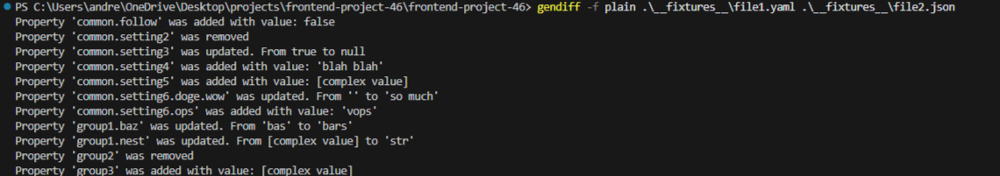

### Hexlet tests and linter status:

[](https://github.com/Smolyakov-Andrei/frontend-project-46/actions)

# Gendiff - File Difference Tool

[](https://github.com/Smolyakov-Andrei/frontend-project-46/actions/workflows/ci.yml)
[](https://sonarcloud.io/summary/new_code?id=Smolyakov-Andrei_frontend-project-46)
[](https://sonarcloud.io/summary/new_code?id=Smolyakov-Andrei_frontend-project-46)
[](https://sonarcloud.io/summary/new_code?id=Smolyakov-Andrei_frontend-project-46)

A CLI tool for comparing configuration files in JSON and YAML formats with multiple output formats.

## 📦 Installation

### Global installation

```bash
npm install -g @hexlet/code
```

Local installation from repository

```bash
git clone https://github.com/Smolyakov-Andrei/frontend-project-46.git
cd frontend-project-46
make install
npm link
```

Usage


📋 Supported Formats
Input Formats:
✅ JSON (.json)

✅ YAML (.yaml, .yml)

Output Formats:
Stylish (default) - Visual tree representation with + and - indicators

Plain - Human-readable text descriptions

JSON - Structured JSON for programmatic use

Comparing JSON files with stylish format (default)



Comparing YAML files with plain format


🛠️ Development

```bash
make install

Run tests

make test

Run linter

make lint
```

🏗️ Project Structure

```bash
frontend-project-46/
├── src/
│ ├── formatters/
│ │ ├── index.js # Форматтер-диспетчер
│ │ ├── stylish.js # Stylish форматтер
│ │ ├── plain.js # Plain форматтер
│ │ └── json.js # JSON форматтер
│ ├── gendiff.js # Основная логика сравнения
│ ├── index.js # Точка входа
│ ├── parsers.js # Парсеры JSON/YAML
│ └── utils.js # Вспомогательные функции
├── **tests**/ # Тесты
├── **fixtures**/ # Тестовые файлы
├── bin/ # CLI интерфейс
└── Makefile # Утилиты сборки
```

📚 Requirements

Node.js 14+
npm 6+

📄 License

ISC
EOF
